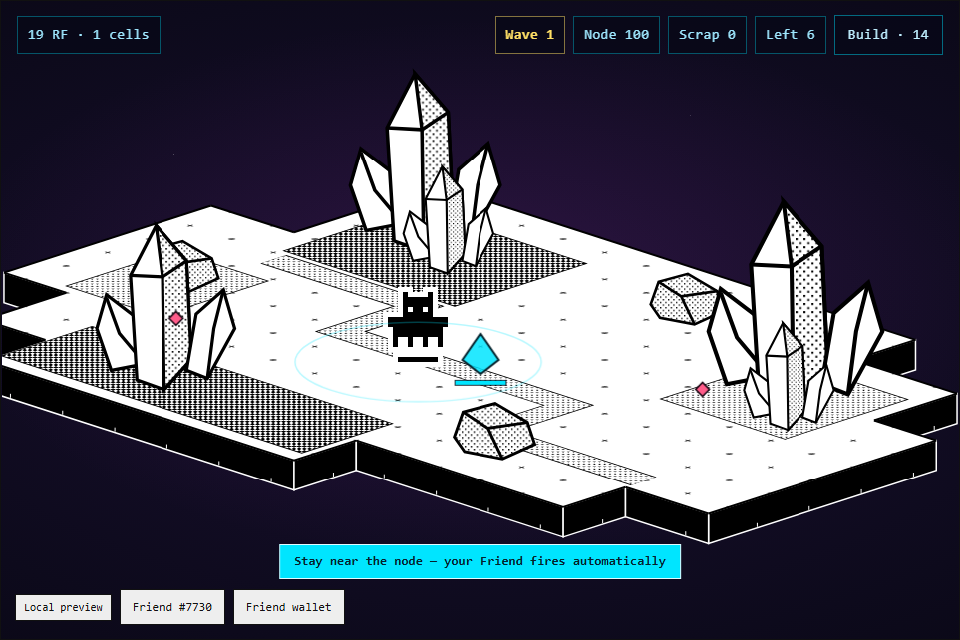

# Friend Fortress

Your Friend guards a crystal node from waves of glitches — **not as a sprite in the scene, but as the
weapon.** It fires automatically at anything in range, so where you stand is the whole skill.

Built with [FriendSDK](https://github.com/spokesz/friendsdk) v0.1.2 for the Rare Friends Vibeathon.

- **Playable preview:** **https://phillipppppp.github.io/rarefriends-fortress/**
- **Builder:** [@phillipppppp](https://github.com/phillipppppp)
- **Category:** Character Spotlight



---

## The loop

1. **Buy a Power Cell** at the Generator — 1 RF each.
2. **Start a defence run** at the Node.
3. **Waves arrive from four lanes.** Your Friend auto-fires; you reposition to intercept and to keep
   the node covered. Turrets are support, bought with scrap earned inside the run rather than with RF.
4. **After wave 3, choose:** bank your reward, or push deeper.

Depth decides **how many rolls** you earn, not the odds:

| Cleared | Rolls |
|---|---|
| Wave 3 | 1 |
| Wave 6 | 2 |
| Wave 9 | 3 |

Each roll spends one Power Cell. **Losing the node still pays for the waves you cleared**, so pushing
risks time and cells, never everything.

## Why depth buys rolls rather than better odds

The obvious design is "deeper runs get better odds." The SDK does not allow it: `game.json` defines one
fixed outcome table and the client enforces it, so shifting weights by performance would mean paying out
RF the client never issued. Buying **more rolls** raises expected reward honestly, keeps the published
table true, and leaves the bank-or-push tension intact.

## Controls

Walk with **WASD**, arrow keys, or tap a destination. Press **E** near a station. During a run, tap
**Build** then tap open ground near the node to place a turret.

## The economy

One Power Cell costs **1 RF**.

| Salvage | Chance | Redeems for |
|---|---:|---:|
| Slag Fragment | 15% | 0 RF |
| Cracked Core | 30% | 0.25 RF |
| Charged Cell | 28% | 0.60 RF |
| Focus Lens | 17% | 1.50 RF |
| Prime Shard | 8% | 3.00 RF |
| Node Heart | 2% | 8.10 RF |

**Expected reward 0.90 RF against a 1 RF price — a 10% house edge**, matching both shipped SDK examples
and verified by the SDK's own `expectedReward`.

## Difficulty, measured rather than guessed

`combat.ts` is pure simulation with no DOM, so whole runs can be played headlessly. That is how the curve
was tuned before any pixel existed.

```bash
node tools/balance-sim.mts
```

Survival to wave 9 by how aggressively the Friend is played:

| Play style | Clears wave 9 |
|---|---|
| Holds the node | 7% |
| Cautious | 23% |
| Forward | 37% |
| **Aggressive but disciplined** | **47%** |
| Chases to the spawn lanes | 13% |

**Over-extending is punished** — chase too far and the node falls behind you. That was not designed; it
emerged from the simulation, and it is what makes positioning matter.

The simulation also showed combat was fully deterministic, with every wave identical between runs, so
spawn position and health now carry a little jitter. Runs vary without becoming lotteries.

A **daily modifier** — Steady, Swarm, Dense or Lean — is derived from the UTC date, so it is the same for
everyone that day and needs no server.

## Checks

```bash
npx tsc -p game/tsconfig.json   # typecheck
npx friendsdk check games/fortress
npx friendsdk test  games/fortress
node tools/balance-sim.mts      # headless difficulty simulation
node tools/loop-e2e.mts         # buy, run, fight, bank, settle, in the real runtime
```

`loop-e2e` drives the real sandboxed runtime: it buys Power Cells, starts a run, confirms enemies spawn
and the overlay actually paints, waits for the bank-or-push choice, then banks and settles the rolls
through `play`/`settle`.

## How the Friend is rendered as the fighter

The SDK paints the Friend onto its own `<canvas>`, so combat is drawn on a second transparent canvas
stacked exactly over it. Each frame reads the live Friend position the runtime publishes and projects
enemies, beams, turrets and the node through the SDK's exported `project()`. Nothing reaches into the
SDK canvas, the parent page, or the wallet.

## Simulated mechanics and known issues

**All balances, purchases and rewards are simulated**, as the SDK preview client intends. No RF moves.
Wallet connection, NFT ownership verification and Friend selection are handled entirely by the SDK
runtime and are not reimplemented here.

- **This is the first playable milestone.** One enemy type carries waves 1–3, with tougher kinds from
  wave 4; one turret type is buildable, upgrades exist in the model but are not yet exposed.
- **Run progress does not survive a reload.** The SDK preview ledger is held in memory.
- **A station prompt sitting under your cursor swallows a click aimed at the ground.** Walk with the
  keyboard, or click elsewhere, if a prompt is in the way.
- **The game does not load inside MetaMask's in-app mobile browser.** The SDK renders games in
  `<iframe sandbox="allow-scripts">` and the bridge handshake does not complete there. It works in
  Chromium and WebKit at desktop and phone viewports, so it is that app's webview rather than the
  engine, and it affects every FriendSDK game equally. Desktop with a browser-extension wallet works.

## Credits

Built on [FriendSDK](https://github.com/spokesz/friendsdk) (Apache-2.0). World scenery, character sprites
and the sound kit are the SDK's. Combat simulation, economy, overlay renderer, wave design and the
bank-or-push structure are original to this submission.
